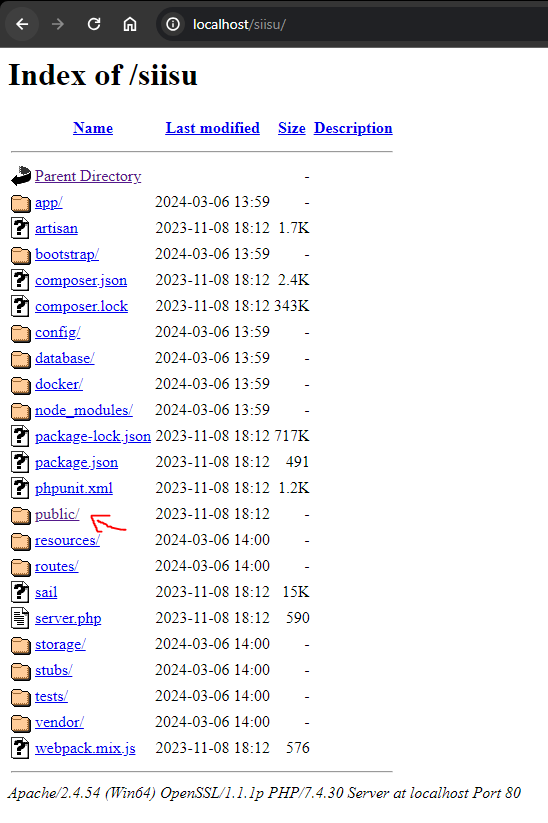

<p align="center"><a></a></p>

## Acerca de SIISU

El Sistema Integral de Información de Servicios Universitarios (SIISU) es una solución informática desarrollada con el propósito de apoyar las operaciones diarias de las áreas de:

- Servicios Escolares
- Servicios Estudiantiles
- Recursos Humanos
- Académica (Directores de carrera, Profesores y Alumnos)
- Vinculación

## Implementación del proyecto

### Requisitos
- Servidor apache2 (Si trabaja en windows puede instalar xampp)
- php 7.4 (Si trabaja en windows puede instalar xampp)
- Instalar Composer https://getcomposer.org/Composer-Setup.exe
- Controlador de SQL para php (este permitirá realizar la conexión de php con SQL Server)
- SQL SERVER 2019 o superor

### Cargar archivo de backup de la base de datos
- Primero deben descargar el archivo de respaldo de la base de datos desde el siguiente enlace: https://drive.google.com/file/d/1GwNdCRHospWttmKZraObDj9OCZu4CQhk/view?usp=sharing
- Deben crear una base de datos nueva y le asignan un nombre
```SQL
create database SIISU
```
- Seleccionan la base de datos SIISU y se van a restaurar base de datos


- Cargan el archivo .bak de la base de datos


- Marcan todas las opciones tal cual se encuentran en las siguientes dos capturas.


- Una vez realizado dar clic en aceptar.

### Instalación de drivers SQL para php
- Ya que tengan configurado el ambiente de desarrollo con apache y php instalado van a descargar el siguiente archivo https://drive.google.com/file/d/1lVZZDPoKLyegT2D1Sd8vC1oB2aWaC-G0/view?usp=sharing
- El .zip contiene dos archivos los cuales van a copiar en la carpeta ext en el directorio xampp\php\ext.
- Una vez copiados los archivos van a agregar las siguientes lineas al archivo php.ini

```
extension=php_pdo_sqlsrv_74_nts_x64.dll
extension=php_pdo_sqlsrv_74_ts_x64.dll
extension=php_sqlsrv_74_nts_x64.dll
extension=php_sqlsrv_74_ts_x64.dll
```

- Guardar cambios y reiniciar apache.

### Conexión a la base de datos
Para configurar la conexión del proyecto a la base de datos hay que acceder al archivo .env que se encuentra en la raiz del proyecto y colocar los datos de acceso sql server.

```
=== DATOS DE EJEMPLO ===
DB_CONNECTION=sqlsrv
DB_HOST=192.168.1.2
DB_PORT=
DB_DATABASE=database
DB_USERNAME=user
DB_PASSWORD=pass
```
Si al momento de haber instalado SQL Server dejaron el puerto por defecto entonces el DB_PORT se deja vacio.

- Despues de haber configurado la conexión entran a localhost en el proyecto al directorio public
  



### Accesos al sistema
Este proyecto tiene cuatro tipo de perfiles.
- Administrador
- Profesor
- Director de carrera
- Recursos Humanos

Para todos los usuarios que tiene el sistema la contraseña es: *pass*

A continuación se muestran los accesos para los diferentes tipos de perfil:

```
Administrador: admin
Recursos Humanos: rh
```

Para el caso de los profesores y directores de carrera los nombres de usuario son diferentes.

Para ver la información de acceso de todos los usuarios ejecutan la siguiente consulta:

```SQL
select p.idpersona, (p.nombre + ' ' + p.paterno + ' ' + p.materno)Nombre, u.Usuario, u.Contraseña, per.idperfil, per.Perfil from Seguridad.Usuarios u
join Persona.persona p on p.idpersona = u.idPersona
join Seguridad.Perfiles per on per.idperfil = u.idPerfil
```

### Diseño de la plantilla
El diseño de la plantilla está realizado con Tailwind CSS, a continuación les comparto el enlace de la plantilla utilizada para que puedan ver los componentes que contiene:
https://midone-html.vercel.app/


### Controlador SQL php
https://learn.microsoft.com/en-us/sql/connect/php/installation-tutorial-linux-mac?view=sql-server-ver15
